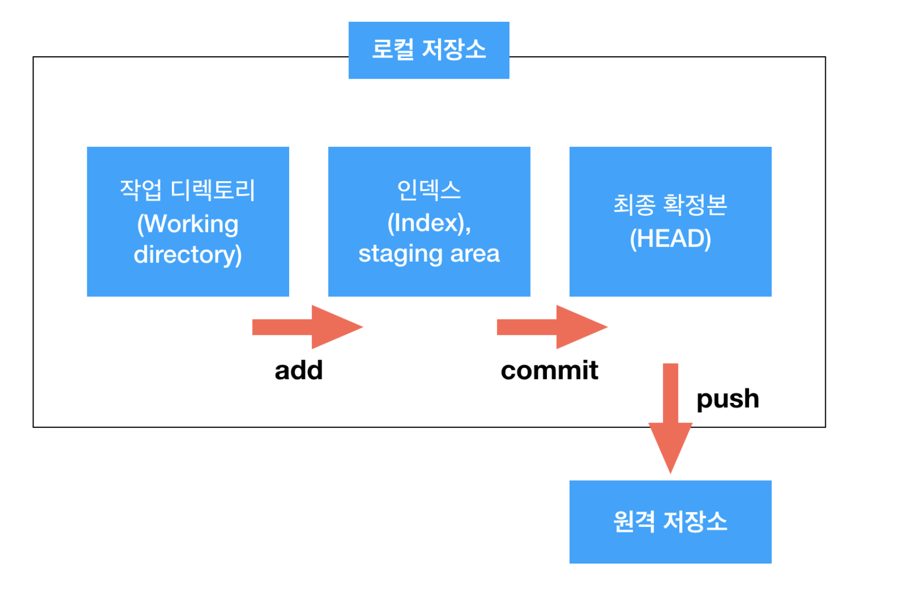

# Git 기본 명령어

### 1. git init

initialize, 초기화를 의미한다.  
이 명령어를 입력하기 전까지는 일반 디렉토리지만 `git init`을 하면 해당 디렉토리를 로컬 깃 디렉토리로 등록해준다.

---

위 사진은 깃의 구조를 나타내주는데 깃 저장소는 크게 로컬 저장소와 원격 저장소로 나뉜다.  
로컬 저장소는 현재 개발자 컴퓨터에 위치한 저장 공간이다.

원격 저장소는 네트워크를 통해 접근할 수 있는 저장소인데 간단히 브라우저에 github 저장소 url치고  
들어가면 그게 원격 저장소다. 보통 GitHub, GitLab에 호스팅 되어있다.

### 2. git status

지정된 저장소의 현재 상태를 나타내고 상태 변경이 필요한 파일들을 알려주기도 한다.  
현재 어떤 파일들이 변경되었는지, 어떤 파일이 트래킹 되지 않았는지 등을 커맨드에서 알려준다.

### 3. git add <파일이름>

git status에 나온 변경 사항들을 스테이지에 올려야한다.  
뒤에 파일 이름을 하나하나 적을 수도 있고 `git add --all`이나 `git add .`을 사용하면  
status에서 나온 모든 변경 사항을 스테이지에 올려준다.

만약 스테이지에 잘 못올리거나 올리고 싶지 않은 파일이 있다면  
`git rm --cached <파일 이름>`을 통해 스테이지에서 내릴 수 있다.

### 4. git commit -m "커밋 이름"

로컬 저장소의 최종 단계인 HEAD에 파일을 등록시키기 위해서 사용하는 명령어이다.  
현재 커밋 대상이 되어있는 파일들을 모두 커밋시키며 -m 뒤에는 버전 관리를 위한 커밋 이름을 작성해야 한다.  
커밋을 한 이후에는 `working tree(작업 공간)`이 비워지게 된다.  
`git commit -m "Add header component"`

### 5. git remote add <원격 저장소 이름> < url >

현재 로컬 저장소를 깃허브에 있는 특정 원격 레포지토리에 연결하는 명령어이다.  
원격 저장소 이름은 보통 origin으로 하는 것이 기본이다.  
만약 연결이 잘 되어있는지를 확인하고 싶다면 `git remote -v`를 입력하면 된다.  
`git remote add origin https://github.com/GSM-MSG/Hi-v2-FrontEnd.git`

### 6. git push <remote 저장소 이름 ><push할 브랜치 이름>

이제 로컬에서의 작업이 모두 끝났다면 git push를 사용해서 로컬 저장소에 있던 파일을  
원격 저장소로 보낼 수 있다.
`git push origin master`

### 7. git clone

위에서는 `git remote`를 이용해서 로컬 저장소에서 만든 깃 폴더를 원격 저장소와 연결했다.  
`git clone`은 반대로 원격 저장소에 있는 폴더를 로컬 저장소에 연결하는 명령어이다.  
이 명령어를 사용하면 깃허브의 레포지토리가 그대로 현재 디렉토리에 복사된다.
`git clone https://github.com/GSM-MSG/Hi-v2-FrontEnd.git`

### 8. git branch <브랜치 이름>

Git flow는 기본적으로 새로운 브랜치에서 작업 사항을 협업자들과 정한 브랜치에 병합하는 형식이다.  
새로운 브랜치는 `git branch` 명령어를 통해서 만들 수 있다.
`git branch feature/header`

### 9. git checkout <브랜치 이름>

`git branch`로 새로운 브랜치를 만들었다면 현재 브랜치에서 새로운 브랜치로 이동하여 작업해야 한다.  
이 명령어가 브랜치를 이동할 수 있는 명령어이다.
`git checkout feature/header`

### 8, 9. git checkout -b <브랜치 이름>

만약 두 작업을 따로따로 할 필요가 없다면 이 명령어를 통해 한 번에 브랜치를 만들고 이동할 수 있다.
`git checkout -b feature/header`
